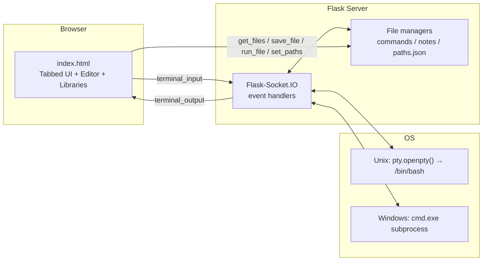

<div align="center">

# 🖥️ Web-Terminal

**A cross-platform, multi-tab terminal in your browser — with a built-in command library and notes database.**

[](https://python.org)
[](https://flask.palletsprojects.com)
[](https://socket.io)
[](https://github.com/Khedr0x00/Web-Terminal)
[](LICENSE)

*A real interactive shell, streamed live to any browser tab over WebSockets.*

</div>

---

## 📖 Overview

**Web-Terminal** wraps a genuine OS shell in a web page. Every browser tab you open gets its own isolated, fully interactive shell session — a real PTY running `/bin/bash` on Linux/macOS, or a `cmd.exe` subprocess on Windows — with keystrokes and output streamed bidirectionally over Socket.IO in real time.

On top of the raw terminal, it ships a small productivity suite for people who live in the shell:

- 📚 **Command Library** — save reusable command scripts, edit them, and run them line-by-line straight into any terminal tab with one click.
- 📝 **Notes Database** — keep `.txt` notes (schemas, queries, runbooks) at your fingertips while you work.
- 🛠️ **Built-in Editor** — create, edit, save, and run files without leaving the page.
- ⚙️ **Configurable Paths** — point the command and note libraries at any set of directories, persisted in `paths.json`.

---

## ✨ Features

| Feature | Details |
|---|---|
| 🗂️ **Multi-tab sessions** | Every tab spawns its own shell. Open 5 tabs → 5 independent shells. Sessions survive brief disconnects. |
| 🐧 **True PTY on Unix** | Uses `pty.openpty()` + `/bin/bash` — full interactive programs (vim, htop, python REPL) work as expected. |
| 🪟 **Windows support** | Falls back to a `cmd.exe` subprocess with character-by-character streaming, manual line editing, `cls` handling, and an interactive Python mode. |
| ⚡ **Real-time I/O** | Flask-Socket.IO streams every byte between the browser and the shell with negligible latency. |
| 📚 **Command database** | Store frequently-used scripts (`.sh` files) and execute them in any active terminal with one click. |
| 📝 **Notes database** | Store `.txt` reference notes (DB schemas, SQL snippets, backup plans). |
| ✏️ **File editor** | Open, edit, save, and *run* library files. Includes **Replace** and **Replace All** tools. |
| ➕ **Quick file creation** | Create new commands or notes from the UI, choosing the target directory. |
| 🔀 **Multiple paths** | Register several directories for both commands and notes; the UI lists files from all of them. |
| 🌐 **Cross-platform** | One codebase, auto-detects Unix vs Windows at startup. |
| 🔌 **Configurable port** | `--port` flag, defaults to `5001`. |

---

## 🚀 Quick Start

### 1. Clone

```bash
git clone https://github.com/Khedr0x00/Web-Terminal.git
cd Web-Terminal
```

### 2. Install dependencies

```bash
pip install -r requirements.txt
```

<details>
<summary><b>Or install manually</b></summary>

```bash
pip install flask flask-socketio
```
</details>

### 3. Run

```bash
python app.py
# or on a custom port:
python app.py --port 8080
```

On first launch the app automatically:

- creates the `commands/` and `notes/` directories,
- seeds them with example command scripts and notes,
- prints the active paths.

### 4. Open it

Visit **http://localhost:5001** — click **New Tab**, and you have a live shell in your browser.

---

## 🧭 Usage Guide

### Terminals

- **New Tab** — spawns a fresh, isolated shell session.
- Each browser tab keeps its own session; output is routed per-connection via Socket.IO rooms.
- Type as you would in any terminal. On Unix, interactive programs (vim, `top`, `python`) work because it's a real PTY.

### Database Commands 📚

1. Click a command file in the **Database Commands** panel to open it in the editor.
2. **Run File** executes each non-empty line as a command in your active terminal tab (with a short pause between lines so output stays readable).
3. **New Command** creates a new script; choose which registered directory it goes into.

### Database Notes 📝

- Click a note to view/edit it in the editor.
- Only `.txt` files are listed, so the panel stays clean.

### Editor ✏️

| Button | Action |
|---|---|
| **Save** | Write changes back to disk (in the file's original directory) |
| **Run** | Execute the file's content line-by-line in the active terminal |
| **Replace** | Replace the first match of a search string |
| **Replace All** | Replace every match in the file |

### Settings ⚙️

- Open **Settings** to manage **command paths** and **note paths**.
- Add or remove directories; new directories are created automatically, changes are persisted to `paths.json` and survive restarts.
- Both lists must contain at least one path — the app rejects empty configurations.

### `paths.json`

Path configuration lives in `paths.json` at the project root:

```json
{
    "commands_paths": ["commands", "/home/me/extra-scripts"],
    "notes_paths": ["notes"]
}
```

- All registered directories are scanned; files are shown with the directory they live in.
- Duplicates and empty strings are stripped automatically.
- If the file is missing or malformed, the app falls back to the defaults (`commands/`, `notes/`).

---

## 🏗️ Architecture



**How it works, briefly:**

1. On `connect`, the server spawns a shell for that Socket.IO session — a PTY pair with `/bin/bash` on Unix, or a `cmd.exe` pipe-based subprocess on Windows — and stores it in a per-`sid` session map.
2. A daemon **reader thread** continuously reads shell output and emits `terminal_output` events to that client's Socket.IO room only.
3. Browser keystrokes arrive as `terminal_input` events and are written directly to the PTY master (Unix) or the subprocess stdin (Windows).
4. Library operations (`get_files`, `get_file_content_for_editor`, `save_file`, `create_file`, `run_file`, `set_paths`) are plain Socket.IO events over the same connection; `run_file` just replays the file's lines into the shell with a 0.5s delay between commands.

### Project structure

```
Web-Terminal/
├── app.py               # Server: Flask + Socket.IO, session mgmt, file APIs
├── requirements.txt
├── paths.json           # Generated: configurable command/note directories
├── commands/            # Default command library (.sh scripts)
├── notes/               # Default notes library (.txt files)
└── templates/
    └── index.html       # Tabbed terminal UI, editor, libraries, settings
```

---

## ⚠️ Security Notice

This application exposes a **fully privileged, real shell** on your machine to anyone who can reach the server. It is intended for **personal use, learning, and trusted local/lab environments**.

- Bind it to `localhost` and keep it off the public internet.
- Do **not** run it on a machine with sensitive data unless you understand the exposure.
- There is no built-in authentication — anyone with the URL has shell access.
- If you need remote access, put it behind an authenticating reverse proxy or VPN, and never commit `paths.json` if it points at sensitive locations.

---

## 🛣️ Roadmap Ideas

- [ ] Authentication (token / password gate)
- [ ] Session persistence and reattach across browser restarts
- [ ] Docker image
- [ ] Terminal recording / playback
- [ ] Search across all notes and commands
- [ ] xterm.js frontend for richer terminal emulation

---

## 🤝 Contributing

Issues and PRs are welcome!

1. Fork the repo
2. Create your branch (`git checkout -b feature/my-feature`)
3. Commit your changes
4. Push and open a Pull Request

---

## 📜 License

Released under the [MIT License](LICENSE).

<div align="center">

**⭐ If this project helped you, consider starring it!**

</div>
